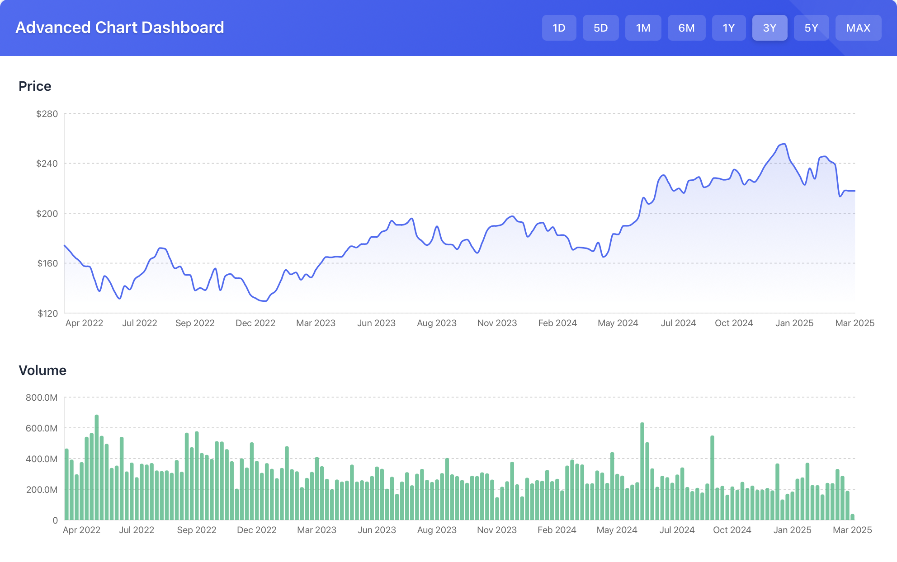
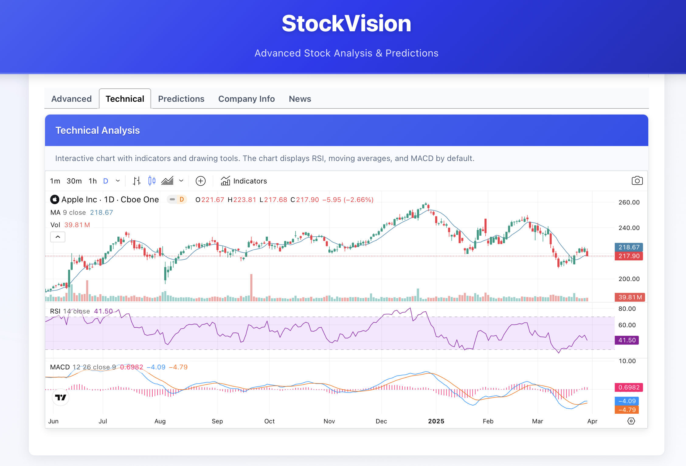
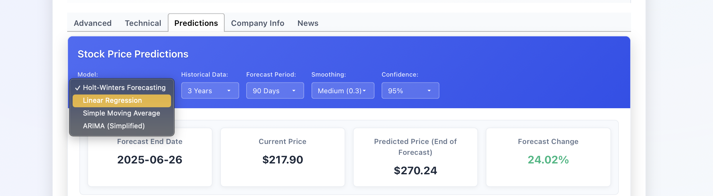
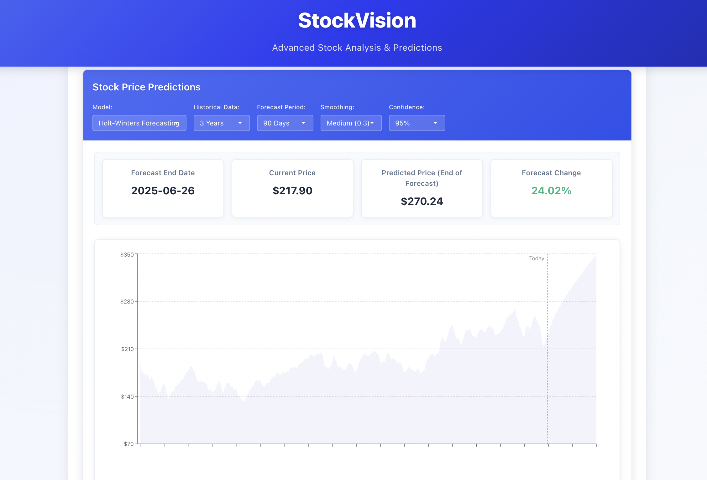

# StockVision



## About

Hey there! I'm excited to share StockVision with you - a little project I've been pouring my nights and weekends into. StockVision is a sleek, interactive dashboard for tracking and visualizing stock market data with built-in prediction capabilities.

I built this because I was tired of jumping between different platforms to get a comprehensive view of stocks. As a hobbyist investor and data nerd, I wanted something that combined clean visualization with some basic predictive analytics - all in one place!

## Features

### Multiple Visualization Types

StockVision offers several ways to look at stock data:

- **Advanced View**: Comprehensive price charts with customizable timeframes (1D, 5D, 1M, 6M, 1Y, 3Y, 5Y)
- **Technical Analysis**: Key technical indicators including RSI, MACD, and Bollinger Bands
- **Volume Analysis**: Track trading volumes to spot trends and potential breakouts
- **Predictions**: AI-powered forecasting to anticipate potential price movements



### Supported Companies

Currently tracking these popular stocks:
- Apple (AAPL)
- Microsoft (MSFT)
- Google (GOOGL)
- Amazon (AMZN)
- Tesla (TSLA)
- Meta/Facebook (META)
- Netflix (NFLX)

More coming soon! (Drop me an issue if you have requests)

### Prediction Methods

StockVision implements several forecasting models:

- **Moving Averages**: Both simple (SMA) and exponential (EMA) for short-term trends
- **Linear Regression**: For establishing trendlines and price targets
- **ARIMA Modeling**: A simplified implementation for time-series forecasting
- **Confidence Intervals**: See the potential range of price movements, not just single predictions



### How Predictions Work

I want to be totally transparent: these predictions are for educational purposes only! The forecasting models process historical price data to identify patterns and project potential future movements. 

For example, the EMA model gives more weight to recent prices while the ARIMA model looks at moving averages, seasonality, and autocorrelation. The confidence intervals show the range where prices might fall with about 80% probability.

Remember: No prediction model can guarantee future results - if they could, I'd be writing this from my private island! These models don't account for unexpected news or market events. Use them as one tool in your research.



## Tech Stack

StockVision is built with:

- **React**: For the front-end UI and component structure
- **Recharts**: Powers the beautiful, responsive visualizations
- **React-Tabs**: For the clean tabbed interface
- **Moment.js**: For date and time formatting
- **JavaScript/ES6+**: All the forecasting algorithms are written in vanilla JS

In a production environment, this would connect to:
- Yahoo Finance API or similar for real-time data

## Local Development

If you want to play with this yourself:

```bash
# Clone the repo
git clone https://github.com/yourusername/stockvision.git

# Install dependencies
cd stockvision
npm install

# Start development server
npm start
```

## What's Next?

I'm actively developing StockVision in my spare time. On my roadmap:
- More companies and market indices
- Cryptocurrency support
- Saving favorite stocks
- Enhanced machine learning models
- Portfolio tracking

---

Built with coffee and code by an indie dev who probably should get more sleep.

If you find this useful or have suggestions, reach out! I'd love to hear from you. 